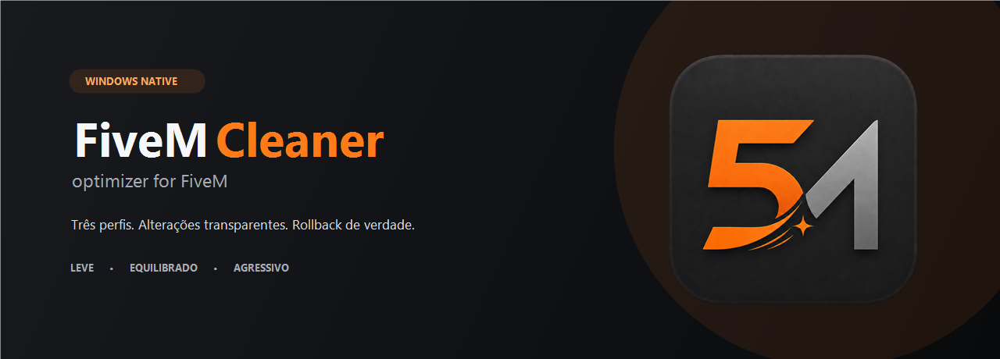
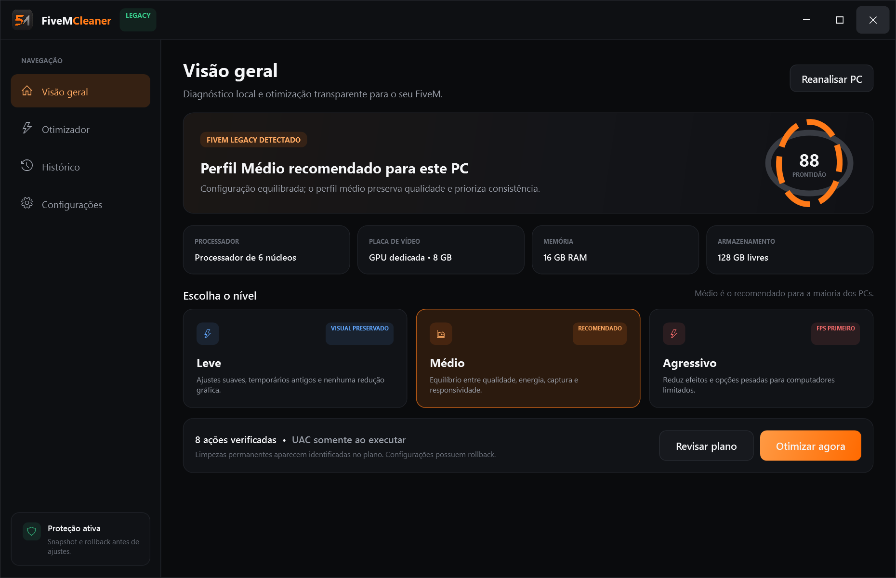

<p align="center">
  
</p>

<h1 align="center">FiveMCleaner</h1>

<p align="center">
  <strong>Otimização transparente, reversível e orientada por diagnóstico para FiveM Legacy no Windows.</strong>
</p>

<p align="center">
  
</p>

<p align="center">
  
  
  
  
  <a href="LICENSE"></a>
</p>

O FiveMCleaner reúne diagnóstico do computador, perfis gráficos conservadores e limpeza inteligente em uma experiência de um clique — sem esconder o que será alterado. A aplicação já oferece prévia, progresso real, journal local e rollback das configurações suportadas.

> [!IMPORTANT]
> O escopo atual é **FiveM para GTAV Legacy**. O cliente para GTAV Enhanced, anunciado em early access para 21 de julho de 2026, usa launcher e gerenciamento de cache diferentes. O FiveMCleaner detecta essa edição e bloqueia alterações até existir uma integração específica validada.

> [!WARNING]
> Nenhum software pode garantir mais FPS em todo PC ou servidor. Scripts, assets, rede, temperatura e limites do hardware também influenciam a experiência. O FiveMCleaner não desativa antivírus, não injeta código, não modifica binários do jogo e não promete resultados irreais.

> [!NOTE]
> Os builds locais desta primeira rodada ainda não possuem assinatura digital de uma autoridade pública. Mesmo com arquitetura transparente e sem ofuscação, o Windows SmartScreen ou outro antivírus pode pedir confirmação enquanto o arquivo não acumula reputação. Releases oficiais deverão ser assinadas; nunca crie uma exclusão de antivírus apenas para executar o app.

## Estado da primeira rodada

- interface WPF funcional com os modos **Leve**, **Médio** e **Agressivo**;
- diagnóstico local de FiveM Legacy, CPU, GPU, memória, armazenamento e processo ativo;
- executor transacional com cache allowlisted, temporários antigos, gráficos, Game Mode, captura, preferência de GPU, efeitos visuais e energia;
- broker administrativo efêmero, sem shell ou comandos recebidos da interface;
- journal por ação, rollback por privilégio e restauração que preserva mudanças posteriores do usuário;
- pacote portátil autossuficiente para `win-x64`, acompanhado de checksums SHA-256;
- GTAV Enhanced bloqueado até uma integração separada ser documentada e testada.

## Visão do produto

| Perfil                  | Prioridade        | Estratégia                                                                                                               |
| ----------------------- | ----------------- | ------------------------------------------------------------------------------------------------------------------------ |
| **Leve**                | Fidelidade visual | Ajustes de baixo impacto, diagnóstico e manutenção de arquivos antigos. Mantém resolução e texturas sempre que possível. |
| **Médio · recomendado** | Equilíbrio        | Reduz os custos gráficos mais relevantes, preserva legibilidade e evita ultrapassar a VRAM disponível.                   |
| **Agressivo**           | Fluidez           | Aceita perda visual explícita, reduz distância, efeitos e escala de renderização para hardware limitado.                 |

Os perfis são composições de ações independentes. O usuário pode revisar cada ação antes de aplicar e restaurar o snapshot anterior depois.

## Dashboard

<p align="center">
  
</p>

> A captura é gerada pelo próprio executável em modo de demonstração sem escrita. Ela não publica os modelos de hardware nem o histórico da máquina usada no desenvolvimento.

## Cache inteligente

“Limpar tudo” não é uma otimização. No FiveM Legacy, recursos baixados podem ocupar muitos gigabytes, mas o cache também evita downloads repetidos. A política do projeto é:

- medir antes de remover;
- limpar somente com todos os processos do FiveM encerrados;
- tratar `server-cache` e `server-cache-priv` como manutenção de espaço ou reparo, não como ganho garantido de FPS;
- alertar que remover `server-cache-priv` pode invalidar clipes antigos do Rockstar Editor;
- proteger sempre `game-storage`, dados de login, configurações, plugins e armazenamento NUI;
- manter limpeza ampla fora dos perfis automáticos.

Veja a matriz completa em [Segurança](docs/safety.md) e a fundamentação em [Pesquisa](docs/research.md).

## Como uma otimização acontece

1. **Diagnóstico** — identifica edição, instalação, hardware, espaço livre e processos ativos.
2. **Prévia** — mostra ações, risco, efeito esperado, necessidade de reinício e rollback.
3. **Snapshot** — preserva configurações pequenas e registra o estado anterior.
4. **Aplicação** — executa ações isoladas, com privilégio mínimo e progresso verificável.
5. **Validação** — confirma que o estado final é válido e gera um relatório local.
6. **Restauração** — reverte o que foi alterado quando solicitado ou em caso de falha.

## Limites intencionais

O FiveMCleaner não:

- altera `commandline.txt`; o FiveM Legacy bloqueia seu carregamento;
- define prioridade `Realtime`, afinidade fixa ou desativa SMT/Hyper-Threading;
- sobrescreve perfis NVIDIA ou força limpeza de shader cache;
- desativa Defender, firewall, serviços essenciais ou atualizações do Windows;
- cria exclusões de antivírus automaticamente;
- apaga `%LOCALAPPDATA%\FiveM\FiveM.app\data\game-storage`;
- remove `ros_id.dat`, `DigitalEntitlements`, configurações ou plugins em um perfil de otimização;
- aplica qualquer ação à edição GTAV Enhanced nesta fase.

## Requisitos para desenvolver

- Windows 10 ou 11 x64;
- [.NET SDK 10.0.302](https://dotnet.microsoft.com/download/dotnet/10.0) ou patch compatível definido em `global.json`;
- PowerShell 7 é opcional para tarefas locais, não para o funcionamento da aplicação;
- cópia legítima e atualizada do GTAV Legacy e FiveM para testes de integração.

```powershell
dotnet restore FiveMCleaner.slnx
dotnet build FiveMCleaner.slnx --configuration Release --no-restore
dotnet test FiveMCleaner.slnx --configuration Release --no-build
dotnet run --project src/FiveMCleaner.App/FiveMCleaner.App.csproj
./scripts/Build-Portable.ps1
```

## Estrutura

```text
src/
├── FiveMCleaner.App/        # aplicação WPF sem elevação permanente
├── FiveMCleaner.Contracts/  # contratos de ações, progresso e resultados
├── FiveMCleaner.Core/       # orquestração, políticas e rollback
├── FiveMCleaner.Windows/    # descoberta e integrações Windows/FiveM
└── FiveMCleaner.Broker/     # operações administrativas estritamente tipadas
tests/
└── FiveMCleaner.Tests/      # testes de política, segurança e execução
docs/
├── architecture.md
├── research.md
└── safety.md
```

Detalhes: [Arquitetura](docs/architecture.md).

## Transparência e fontes

As decisões do projeto priorizam documentação do Cfx.re, suporte oficial, repositório `citizenfx/fivem`, suporte Rockstar e documentação de fabricantes. Fatos observados e inferências de engenharia são rotulados separadamente em [docs/research.md](docs/research.md).

## Contribuindo e segurança

- Leia [CONTRIBUTING.md](CONTRIBUTING.md) antes de propor uma ação de sistema.
- Vulnerabilidades devem seguir [SECURITY.md](SECURITY.md), sem issue pública.
- Toda contribuição está sujeita ao [Código de Conduta](CODE_OF_CONDUCT.md).

## Licença e não afiliação

Código disponibilizado sob a [Licença MIT](LICENSE).

**FiveMCleaner é um projeto comunitário independente. Não é aprovado, patrocinado, endossado nem afiliado à Rockstar Games, Cfx.re ou FiveM.** FiveM, Grand Theft Auto V, Rockstar Games e marcas relacionadas pertencem aos respectivos titulares. A marca é usada apenas para indicar compatibilidade.
