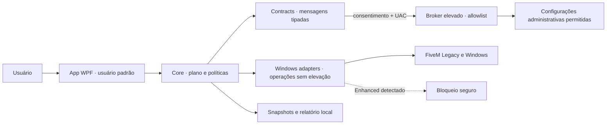

# Arquitetura

Este documento descreve a arquitetura-alvo e os limites entre componentes. Uma classe ou fluxo só deve ser tratado como entregue quando existir implementação e teste correspondente.

## Objetivos

- manter a interface sem privilégio administrativo permanente;
- representar cada alteração como ação pequena, tipada e reversível;
- separar descoberta Windows de política de produto;
- impedir que um perfil amplie silenciosamente o escopo de uma ação;
- oferecer progresso real por etapas, não uma animação temporal;
- suportar instalação personalizada do FiveM Legacy;
- bloquear GTAV Enhanced até existir adaptador próprio;
- permitir testes sem alterar a máquina do desenvolvedor.

## Componentes

| Projeto                  | Responsabilidade                                                    | Não deve conhecer                                        |
| ------------------------ | ------------------------------------------------------------------- | -------------------------------------------------------- |
| `FiveMCleaner.App`       | WPF, navegação, prévia, progresso e confirmação                     | APIs administrativas ou detalhes de registro             |
| `FiveMCleaner.Contracts` | DTOs, IDs, estados, erros e contratos entre processos               | WPF ou implementação Windows                             |
| `FiveMCleaner.Core`      | casos de uso, composição de perfis, políticas, transação e rollback | controles visuais ou comandos shell                      |
| `FiveMCleaner.Windows`   | descoberta de hardware/instalação e adaptadores Windows/FiveM       | decisão de qual perfil o usuário deve escolher           |
| `FiveMCleaner.Broker`    | executor elevado com allowlist mínima                               | navegação, telemetria ou lógica de produto ampla         |
| `FiveMCleaner.Tests`     | contratos, políticas, falhas, rollback e doubles de sistema         | dependência de uma instalação real para testes unitários |

## Fronteira de confiança



O broker não é uma “shell como administrador”. Contratos não carregam scripts nem comandos livres.

## Modelo de domínio

### Diagnóstico

Um snapshot de diagnóstico deve conter fatos, não recomendações:

- edição e caminho canônico da instalação;
- versão conhecida do cliente;
- processos ativos relacionados ao diretório;
- CPU, RAM, GPU, VRAM, sistema e espaço livre;
- presença e tamanho de caches reconhecidos;
- estado das configurações suportadas;
- alertas de ambiguidade, permissão ou corrupção.

Políticas do Core transformam esse snapshot em recomendações.

### Ação

Cada ação tem contrato equivalente a:

```text
id + versão
descrição e evidência
escopo de leitura/escrita
pré-condições
estado atual e estado desejado
risco e privilégio
aplicar + verificar + restaurar
progresso por etapas
```

IDs são estáveis para que relatórios e snapshots continuem interpretáveis entre versões.

### Plano

Um plano é uma lista ordenada e imutável de ações resolvidas para aquele diagnóstico. Depois que o usuário confirma:

- nenhuma ação nova pode ser adicionada;
- caminhos não podem ser recalculados para outro alvo;
- conflito entre ações invalida o plano;
- o broker recebe somente o subconjunto privilegiado já aprovado.

### Resultado

Estados mínimos:

- `Skipped` — pré-condição não satisfeita sem erro;
- `Applied` — alteração e pós-condição confirmadas;
- `NoChange` — máquina já estava no estado desejado;
- `Failed` — alteração não confirmada;
- `RolledBack` — estado anterior restaurado;
- `RollbackFailed` — requer atenção e relatório destacado;
- `Blocked` — edição/segurança não suportada.

## Perfis

Leve, Médio e Agressivo são seleções versionadas de ações e parâmetros. Eles não implementam operações diretamente.

```text
Perfil → Política de hardware → Ações propostas → Prévia do usuário → Plano imutável
```

Isso permite:

- desmarcar uma ação sem criar um quarto perfil;
- testar cada ação isoladamente;
- comparar versões de um perfil;
- impedir que “Agressivo” se torne sinônimo de mudanças irreversíveis.

Cache é um módulo de manutenção separado e não entra implicitamente nesses perfis.

## Adaptador FiveM Legacy

Responsabilidades:

- localizar instalação padrão e personalizada;
- validar `CitizenFX.ini` e `IVPath` sem reescrevê-los por conveniência;
- mapear somente diretórios conhecidos sob `FiveM.app`;
- identificar processos por caminho da imagem, não só por nome;
- ler e editar `gta5_settings.xml` preservando schema e nós desconhecidos;
- proteger `game-storage`, `nui-storage`, plugins e autenticação;
- calcular tamanho de caches sem segui-los para fora do root canônico.

O parser XML altera apenas chaves presentes. Um arquivo inválido gera ação de reparo separada; nunca é substituído por um template genérico.

## Guard de GTAV Enhanced

O Enhanced tem launcher, ciclo de processo e cache diferentes. Até o adaptador próprio existir:

1. a descoberta identifica sinais inequívocos da edição;
2. o Core retorna `Blocked` com explicação;
3. nenhum fallback Legacy é tentado;
4. o usuário recebe links para o estado de suporte do projeto;
5. testes garantem que nenhum executor seja chamado.

Quando o suporte for implementado, ele deve ser um adaptador separado e passar por nova pesquisa de caminhos, rollback e políticas.

## Execução, progresso e cancelamento

Progresso é calculado por passos concluídos e pesos declarados. Mensagens devem descrever ações reais, por exemplo “Validando snapshot gráfico”, não frases genéricas.

Cancelamento:

- é aceito antes de iniciar uma ação ou depois de um passo atômico;
- uma escrita crítica termina ou restaura antes de honrar o cancelamento;
- ações não canceláveis declaram isso na prévia;
- o relatório diferencia cancelamento limpo de falha.

## Persistência

O MVP grava somente sob `%LOCALAPPDATA%\FiveMCleaner`:

- `Transactions/<id>.json`: plano, estados por ação e snapshots pequenos necessários ao rollback;
- `Requests/<id>.json`: solicitação efêmera e de uso único consumida atomicamente pelo broker;
- `settings.json`: preferências do próprio FiveMCleaner;
- `crash.log`: exceções fatais locais, criado apenas quando necessário.

Caches não são copiados para o journal. Durante uma limpeza, arquivos allowlisted são movidos para uma quarentena dentro do próprio volume; a ação restaura essa quarentena se falhar antes do commit e a remove somente ao confirmar a transação.

## Testabilidade

Adaptadores de sistema ficam atrás de interfaces. Testes devem cobrir:

- caminhos fora do root e reparse points;
- instalação personalizada;
- FiveM ativo durante uma ação;
- Enhanced bloqueado;
- XML válido, desconhecido e corrompido;
- falha antes, durante e depois de uma escrita;
- rollback que restaura tipo, existência e conteúdo;
- falta de espaço para snapshot/quarentena;
- broker rejeitando ação, versão ou alvo desconhecido;
- composição de perfis sem cache implícito;
- mensagens de progresso e cancelamento.

Testes de integração que alteram Windows ou FiveM devem ser opt-in, isolados e nunca rodar automaticamente na máquina do contribuidor.

## Distribuição

O pipeline público deve:

- compilar no Windows com o SDK fixado em `global.json`;
- executar testes em Release;
- produzir artefatos determinísticos;
- assinar releases oficiais quando houver infraestrutura de assinatura;
- publicar checksums junto ao código-fonte correspondente;
- não realizar self-update arbitrário nem baixar payloads executáveis.

## Não objetivos

- competir com antivírus ou ferramentas de manutenção geral;
- “debloat” irrestrito do Windows;
- modificar servidores ou recursos de terceiros;
- burlar pure mode, anti-cheat ou integridade;
- consertar scripts/assets ruins do servidor pelo cliente;
- suportar GTAV Enhanced reutilizando suposições do Legacy.
