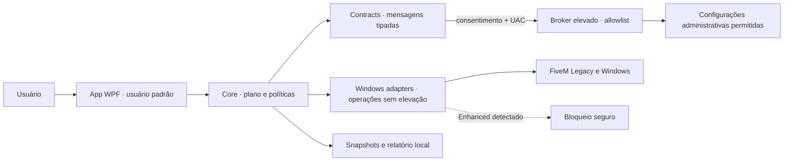

# Arquitetura

Este documento descreve a arquitetura-alvo e os limites entre componentes. Uma classe ou fluxo só deve ser tratado como entregue quando existir implementação e teste correspondente.

## Objetivos

- manter a interface sem privilégio administrativo permanente;
- representar cada alteração como ação pequena, tipada e reversível;
- separar descoberta Windows de política de produto;
- impedir que um perfil amplie silenciosamente o escopo de uma ação;
- oferecer progresso real por etapas, não uma animação temporal;
- suportar instalação personalizada do FiveM Legacy;
- bloquear GTAV Enhanced até existir adaptador próprio;
- permitir testes sem alterar a máquina do desenvolvedor.

## Componentes

| Projeto                  | Responsabilidade                                                    | Não deve conhecer                                        |
| ------------------------ | ------------------------------------------------------------------- | -------------------------------------------------------- |
| `FiveMCleaner.App`       | WPF, navegação, prévia, progresso e confirmação                     | APIs administrativas ou detalhes de registro             |
| `FiveMCleaner.Contracts` | DTOs, IDs, estados, erros e contratos entre processos               | WPF ou implementação Windows                             |
| `FiveMCleaner.Core`      | casos de uso, composição de perfis, políticas, transação e rollback | controles visuais ou comandos shell                      |
| `FiveMCleaner.Windows`   | descoberta de hardware/instalação e adaptadores Windows/FiveM       | decisão de qual perfil o usuário deve escolher           |
| `FiveMCleaner.Broker`    | executor elevado com allowlist mínima                               | navegação, telemetria ou lógica de produto ampla         |
| `FiveMCleaner.Tests`     | contratos, políticas, falhas, rollback e doubles de sistema         | dependência de uma instalação real para testes unitários |

## Fronteira de confiança


```mermaid
flowchart LR
  U["Usuário"] --> A["App WPF · usuário padrão"]
  A --> C["Core · plano e políticas"]
  C --> W["Windows adapters · operações sem elevação"]
  C --> K["Contracts · mensagens tipadas"]
  K -->|"consentimento + UAC"| B["Broker elevado · allowlist"]
  W --> F["FiveM Legacy e Windows"]
  B --> S["Configurações administrativas permitidas"]
  C --> R["Snapshots e relatório local"]
  W -. "Enhanced detectado" .-> X["Bloqueio seguro"]
```

O broker não é uma “shell como administrador”. Contratos não carregam scripts nem comandos livres.

## Modelo de domínio

### Diagnóstico

Um snapshot de diagnóstico deve conter fatos, não recomendações:

- edição e caminho canônico da instalação;
- versão conhecida do cliente;
- processos ativos relacionados ao diretório;
- CPU, RAM, GPU, VRAM, sistema e espaço livre;
- presença e tamanho de caches reconhecidos;
- estado das configurações suportadas;
- alertas de ambiguidade, permissão ou corrupção.

Políticas do Core transformam esse snapshot em recomendações.

### Ação

Cada ação tem contrato equivalente a:

```text
id + versão
descrição e evidência
escopo de leitura/escrita
pré-condições (incluindo pré-requisitos de outras ações, quando existem)
estado atual e estado desejado
risco, privilégio e criticidade (aborta o restante da execução se falhar?)
aplicar + verificar + restaurar
progresso por etapas
versões do Windows suportadas
documentação: como detectar, como confirmar, como desfazer, riscos/limitações
```

IDs são estáveis para que relatórios e snapshots continuem interpretáveis entre versões. Os campos de pré-requisito, criticidade, versões do Windows e documentação vivem em `ActionMetadataDto`/`OptimizationActionDefinition` e alimentam tanto o motor de execução quanto a revisão do plano na interface.

### Plano

Um plano é uma lista ordenada e imutável de ações resolvidas para aquele diagnóstico. Depois que o usuário confirma:

- nenhuma ação nova pode ser adicionada;
- caminhos não podem ser recalculados para outro alvo;
- conflito entre ações invalida o plano;
- o broker recebe somente o subconjunto privilegiado já aprovado.

### Resultado

`ActionExecutionOutcome` (`FiveMCleaner.Contracts`) é o estado semântico usado por progresso e relatório:

- `Verified` — máquina já estava no estado desejado; nenhuma escrita ocorreu;
- `Applied` — alteração e pós-condição confirmadas;
- `Skipped` — pré-condição, opção ou pré-requisito ausente, sem erro;
- `Warning` — aplicado com ressalva reportável;
- `Failed` — erro genuíno; a própria ação foi revertida;
- `RolledBack` — revertida com sucesso após falha;
- `RollbackFailed` — requer atenção e fica destacado no relatório;
- `NotRun` — não executada porque uma falha crítica anterior abortou o restante da run.

Esse enum é independente do estado transacional interno do journal
(`WindowsActionJournalState`), que continua controlando elegibilidade de
rollback e resumo de transação.

## Perfis

Leve, Médio e Agressivo são seleções versionadas de ações e parâmetros. Eles não implementam operações diretamente.

```text
Perfil → Política de hardware → Ações propostas → Prévia do usuário → Plano imutável
```

Isso permite:

- desmarcar uma ação sem criar um quarto perfil;
- testar cada ação isoladamente;
- comparar versões de um perfil;
- impedir que “Agressivo” se torne sinônimo de mudanças irreversíveis.

Cache é um módulo de manutenção separado e não entra implicitamente nesses perfis.

## Adaptador FiveM Legacy

Responsabilidades:

- localizar instalação padrão e personalizada;
- validar `CitizenFX.ini` e `IVPath` sem reescrevê-los por conveniência;
- mapear somente diretórios conhecidos sob `FiveM.app`;
- identificar processos por caminho da imagem, não só por nome;
- ler e editar `gta5_settings.xml` preservando schema e nós desconhecidos;
- proteger `game-storage`, `nui-storage`, plugins e autenticação;
- calcular tamanho de caches sem segui-los para fora do root canônico.

O parser XML altera apenas chaves presentes. Um arquivo inválido gera ação de reparo separada; nunca é substituído por um template genérico.

## Guard de GTAV Enhanced

O Enhanced tem launcher, ciclo de processo e cache diferentes. Até o adaptador próprio existir:

1. a descoberta identifica sinais inequívocos da edição;
2. o planejamento retorna um bloqueio de plano (`PlanBlockCode.EnhancedNotSupported`) com explicação;
3. nenhum fallback Legacy é tentado;
4. o usuário recebe links para o estado de suporte do projeto;
5. testes garantem que nenhum executor seja chamado.

Quando o suporte for implementado, ele deve ser um adaptador separado e passar por nova pesquisa de caminhos, rollback e políticas.

## Execução, progresso e cancelamento

Progresso é calculado por passos concluídos e pesos declarados. Mensagens devem descrever ações reais, por exemplo “Validando snapshot gráfico”, não frases genéricas. O progresso também expõe etapa atual / total de etapas (`CompletedSteps`/`TotalSteps` em `WindowsActionProgress` e `AppProgressUpdate`) e o outcome de cada etapa. A interface do Otimizador mostra apenas a etapa atual e a imediatamente anterior, mais escura, para manter o acompanhamento claro sem expor uma lista técnica de ações.

## Telemetria opcional

`IAnonymousTelemetryService` é uma fronteira da camada App, separada do
serviço de otimização. A preferência persistida `AppSettings.ShareAnonymousTelemetry`
nasce como `true` em instalações novas, mas nada é enviado antes do
consentimento versionado ser confirmado (`PrivacyConsentEvaluator`); o
`MainViewModel` só gera um evento ao término de uma otimização após isso. O
contrato `AnonymousTelemetryEvent` não aceita payload livre: contém o nome
allowlisted do evento, duração, versão, categoria de erro allowlisted em
falha e, desde a versão 2 do consentimento, um perfil de hardware (CPU/GPU/
RAM em faixas) e os IDs das ações aplicadas. O transporte ativo é
`CloudflareTelemetryService.cs`
(`LocalTelemetryQueue`/`CloudflareTelemetryTransport`/
`QueuedCloudflareTelemetryService`), que envia o evento completo para o
Worker em `infra/cloudflare-worker/`. O FormSubmit foi removido do código —
não existe mais um transporte alternativo. O relato de bug segue o mesmo
padrão: `CloudflareBugReportService.cs` envia para a rota `/bugs` do Worker,
somente texto (sem anexo/captura de tela, sem R2). Qualquer erro de transporte é
suprimido localmente para não alterar a execução nem os logs. Detalhes de
privacidade: [telemetry.md](telemetry.md) e [bug-reports.md](bug-reports.md).

### Relatório de falhas e configuração centralizada

`ICrashReportingService` (implementação `SentryCrashReportingService`) é
outra fronteira da camada App, análoga à de telemetria: nunca inicializada
antes do consentimento (`AppSettings.ShareCrashReports` combinado com
`PrivacyConsentVersion` em dia, via o mesmo `PrivacyConsentEvaluator`), e
nunca referenciada por `Core`/`Windows`/`Broker`. `MainWindow` a inicializa
uma única vez, logo depois que o fluxo de consentimento resolve, usando
`RemoteServicesOptionsLoader` para ler o DSN de um arquivo de configuração
por ambiente (`Config/appsettings.{Development,Production}.json`, com
`appsettings.json` como base sem DSN) — nenhum identificador remoto fica
hardcoded em código-fonte. `AppEnvironment.Resolve()` decide entre
Development/Production (variável `FIVEMCLEANER_ENVIRONMENT`, com fallback
por configuração de build), permitindo separar no Sentry os erros do
desenvolvedor dos erros de usuários finais sem duplicar DSN nem projeto.
Todo evento passa por `CrashReportSanitizer` (reaproveitando
`ReportSanitizer`) antes de sair do processo. Detalhes: [telemetry.md](telemetry.md).

## Interrupção de otimização pela interface

O `MainWindow` não encerra nem chama `MainViewModel.CancelOptimization()`
diretamente enquanto `IsBusy` for verdadeiro. Ambos os caminhos de interface
(botão de cancelar e fechamento da janela, inclusive pelo ícone da bandeja)
passam por `OptimizationConfirmationWindow`, um modal localizado e temático.
Ao confirmar, o view-model solicita o token de cancelamento já existente; a
execução mantém a garantia de concluir ou reverter a etapa atual. Um fechamento
confirmado agenda o encerramento somente depois que `StartOptimizationAsync`
retorna. O evento de sessão do Windows é exceção: não mostra modal e não impede
logoff/desligamento.

A execução do usuário padrão roda com `WindowsTransactionOptions.IsolateFailures = true`: cada ação do plano é aplicada, validada e registrada como uma mini-transação independente.

- uma falha genuína reverte somente a própria ação (rollback atômico existente, sem afetar as demais);
- uma ação cujo pré-requisito não teve sucesso (`Prerequisites` em `ActionMetadataDto`) é marcada `Skipped`, nunca executada;
- uma ação crítica (`IsCritical`, hoje as verificações de processo FiveM/GTA V) que falha aborta as ações independentes restantes, que ficam `NotRun`;
- a transação final é `Committed` somente se nenhuma ação falhou; caso contrário `CommittedWithErrors`, e o relatório (`OptimizationReportDto`, construído por `OptimizationReportBuilder`) nunca marca a run como bem-sucedida.
- o broker elevado continua no modo estrito (tudo-ou-nada), pois normalmente delega uma única ação administrativa por vez.

**Falha da fase elevada não desfaz a fase de usuário padrão.** Quando o
broker falha ou o UAC é cancelado, `AppOptimizationService` não chama mais
um rollback das ações de usuário padrão já confirmadas — isso causava o
efeito de "várias ações falhando de uma vez" quando na verdade só uma ação
administrativa havia falhado (ver investigação de 24/07/2026 e correção de
26/07/2026 no `PROJECT_STATE.md`). Em vez disso,
`WindowsTransactionEngine.MarkAdministratorPhaseFailedAsync` marca somente
a(s) ação(ões) administrativa(s) ainda pendente(s) como `Failed` no journal,
preservando intactas as ações já `Committed`; a transação se estabiliza em
`CommittedWithErrors` e o resumo deixa explícito que as demais alterações
foram mantidas.

**Ações administrativas com `AttemptWithoutElevationFirst` tentam sem UAC
primeiro.** `EnableSessionPerformancePowerPlan` e (desde 26/07/2026)
`ToggleHags` usam esse sinalizador em `ActionMetadataDto`: o motor a inclui
na fase de usuário padrão mesmo sem elevação; se o Windows genuinamente
recusar (`UnauthorizedAccessException`, distinguido de outros tipos de
"não deu certo" — por exemplo `PowerPlanActivationOutcome.AccessDenied`
versus "este PC não tem esse plano" via código de saída/mensagem do
`powercfg`), o motor devolve a ação para `DeferredPrivilege` em vez de
marcá-la como falha — só então o broker elevado é acionado. Em muitas
configurações do Windows um usuário comum já pode trocar o plano de
energia, então nenhum UAC chega a aparecer; `ToggleHags` na prática quase
sempre precisa de elevação (escreve em `HKLM`), mas usa o mesmo mecanismo
por consistência.

**Ações opt-in de perfil Agressivo, nunca automáticas** (também desde
26/07/2026): `windows.gaming.gpu-preference-mismatch.diagnose` (👁,
diagnóstico, todos os perfis), `windows.gaming.fullscreen-optimizations.toggle`
e `windows.gaming.hags.toggle` (🧪, ambas Agressivo apenas, desligadas por
padrão via `OptimizationOptionsDto.ToggleFullscreenOptimizationsExperiment`/
`ToggleHagsExperiment`) — mesmo padrão já usado por outras opções opt-in
deste projeto (`TerminateStuckFiveMProcess`, `ApplyGtaVRepairLaunchParameters`
etc.): existem no backend e no catálogo, mas ainda não têm controle na
interface do app. Ver `docs/graphics-optimizations-backlog.md` para a
classificação completa e o que ainda não foi implementado (VRR, janela sem
bordas do Windows 11, HDR, troca automática de frequência do monitor).

**Diagnósticos/orientações somente leitura, todos os perfis** (26/07/2026,
quarta rodada): `windows.gaming.gsync.guide` (orienta habilitar G-SYNC/VRR
pelo painel do fabricante, nunca ativa sozinho, sugere `-frameLimit` com
base na taxa de atualização detectada) e a extensão de
`DiagnoseDriverVersions` para alertar sobre driver de vídeo com mais de 18
meses (pela data real do driver, `DriverDate`, não pela string de versão).
`windows.system.driver-reinstall.guide` (🔧, opt-in, todos os perfis) segue
o mesmo padrão das outras ações de reparo opt-in: mostra os passos oficiais
de reinstalação limpa (DDU + instalador do fabricante), nunca executa nada
sozinho. Nenhuma configuração de perfil 3D por aplicativo da NVIDIA
(baixa latência, G-SYNC por app, limite de FPS pelo driver, etc.) foi
implementada — a NVIDIA não publica API pública suportada para isso, a
mesma política já documentada acima para o painel oficial do fabricante.

**Generalização por fabricante (26/07/2026, quinta rodada — lote AMD)**:
`GSyncGuidanceDiagnosisAction` ganhou `IGpuVendorInspector` e agora nomeia
"NVIDIA Control Panel (Configurar G-SYNC)" ou "AMD Software: Adrenalin
Edition (FreeSync)" conforme o fabricante detectado, em vez de citar só
NVIDIA; `GpuVendorDetectionAction.Classify` ganhou links de download por
fabricante (nvidia.com/drivers, drivers.amd.com, Intel). Nenhuma
configuração de perfil por aplicativo do AMD Software: Adrenalin Edition
(Anti-Lag, Chill, Boost, Image Sharpening, Radeon Super Resolution,
Enhanced Sync, limite de FPS, perfil por app, AMD Fluid Motion Frames) foi
implementada, pela mesma razão já documentada para a NVIDIA — a AMD também
não publica API pública suportada para isso.

**Notebooks híbridos (26/07/2026, sexta rodada — lote Intel)**:
`windows.gaming.hybrid-laptop.diagnose`/`HybridLaptopDiagnosisAction` (👁,
todos os perfis) combina `IPowerStatusProvider.IsBatterySaverActive()`
(novo) com a detecção já existente de CA/bateria, e um novo
`IVendorLaptopSoftwareInspector`/`WindowsVendorLaptopSoftwareInspector`
que detecta (via registro de desinstalação, mesmo padrão do
`StreamingSoftwareDetector`) utilitários conhecidos de troca de
GPU/desempenho do fabricante do notebook (Armoury Crate, MSI Center,
Lenovo Vantage etc.). É a única forma honesta de "detectar MUX switch"
sem controlar BIOS/MUX por método genérico não documentado — detecta a
ferramenta que controlaria o switch, nunca afirma que o switch em si
existe. A maior parte do lote Intel já estava coberta por infraestrutura
vendor-neutra das rodadas anteriores (detecção de GPU/driver, preferência
de GPU de alto desempenho, diagnóstico de throttling térmico).

**Energia e CPU (26/07/2026, sétima rodada) — limite arquitetural
importante para o roadmap**: `windows.power.pcie-aspm.adjust`
(`PciExpressPowerManagementAction`, Médio/Agressivo) e
`windows.gaming.mouse-polling-rate.guide` (`MousePollingRateGuidanceAction`,
todos os perfis) foram implementados por caberem no modelo transacional
atual (ajuste único, reversível, sem depender de vigilância contínua). A
maior parte do lote pedido nessa rodada — plano de energia próprio
ativado/restaurado por sessão, prioridade de processo restaurada ao
fechar, afinidade de CPU, core parking, timer resolution solicitado
enquanto o jogo está aberto — **não foi implementada porque pressupõe um
processo de vigilância de ciclo de vida do FiveM/GTA V (detectar
início/fim em tempo real) que este produto não tem**. O FiveMCleaner é
hoje "aplicar uma vez, verificar, confirmar, reverter se necessário", não
um serviço residente que reage a um processo abrindo/fechando. Ver
`docs/graphics-optimizations-backlog.md`, seção 13, para a lista completa
e a recomendação de que uma sessão futura decida essa arquitetura de
vigilância explicitamente antes de portar qualquer um desses itens para o
catálogo.

Cancelamento:

- é aceito antes de iniciar uma ação ou depois de um passo atômico;
- uma escrita crítica termina ou restaura antes de honrar o cancelamento;
- ações não canceláveis declaram isso na prévia;
- o relatório diferencia cancelamento limpo de falha.

## Persistência

O MVP grava somente sob `%LOCALAPPDATA%\FiveMCleaner`:

- `Transactions/<id>.json`: plano, estados por ação e snapshots pequenos necessários ao rollback;
- `Requests/<id>.json`: solicitação efêmera e de uso único consumida atomicamente pelo broker;
- `settings.json`: preferências do próprio FiveMCleaner;
- `crash.log`: exceções fatais locais, criado apenas quando necessário.

Caches não são copiados para o journal. Durante uma limpeza, arquivos allowlisted são movidos para uma quarentena dentro do próprio volume; a ação restaura essa quarentena se falhar antes do commit e a remove somente ao confirmar a transação.

## Testabilidade

Adaptadores de sistema ficam atrás de interfaces. Testes devem cobrir:

- caminhos fora do root e reparse points;
- instalação personalizada;
- FiveM ativo durante uma ação;
- Enhanced bloqueado;
- XML válido, desconhecido e corrompido;
- falha antes, durante e depois de uma escrita;
- rollback que restaura tipo, existência e conteúdo;
- falta de espaço para snapshot/quarentena;
- broker rejeitando ação, versão ou alvo desconhecido;
- composição de perfis sem cache implícito;
- mensagens de progresso e cancelamento;
- execução isolada: falha não crítica não afeta ações independentes; falha
  crítica aborta o restante (`NotRun`); pré-requisito não atendido gera
  `Skipped`; falha de commit reverte só a própria ação;
- construção do relatório estruturado e sanitização do relatório técnico
  copiável (sem nome de usuário em caminhos, sem segredos).

Testes de integração que alteram Windows ou FiveM devem ser opt-in, isolados e nunca rodar automaticamente na máquina do contribuidor.

## Distribuição

### Atualizador independente

O processo WPF não instala sua própria atualização. Após a confirmação do
usuário, ele baixa e verifica o setup oficial, copia o
`FiveMCleaner.Updater.exe` self-contained para `%LOCALAPPDATA%\FiveMCleaner\Updater`
e encerra. O atualizador aceita apenas um contrato fixo: instalador sob
`Updates`, tamanho, SHA-256, PID do processo pai e log sob `Logs`; ele repete a
verificação de integridade, espera o PID terminar sem encerrar processos de
forma forçada e só então executa o Inno Setup. Assim, o processo que aguarda e
o diretório que o setup substitui nunca são o mesmo.

O pipeline público deve:

- compilar no Windows com o SDK fixado em `global.json`;
- executar testes em Release;
- produzir artefatos determinísticos;
- assinar releases oficiais quando houver infraestrutura de assinatura;
- publicar checksums junto ao código-fonte correspondente;
- não realizar self-update arbitrário nem baixar payloads executáveis.

## Não objetivos

- competir com antivírus ou ferramentas de manutenção geral;
- “debloat” irrestrito do Windows;
- modificar servidores ou recursos de terceiros;
- burlar pure mode, anti-cheat ou integridade;
- consertar scripts/assets ruins do servidor pelo cliente;
- suportar GTAV Enhanced reutilizando suposições do Legacy.
